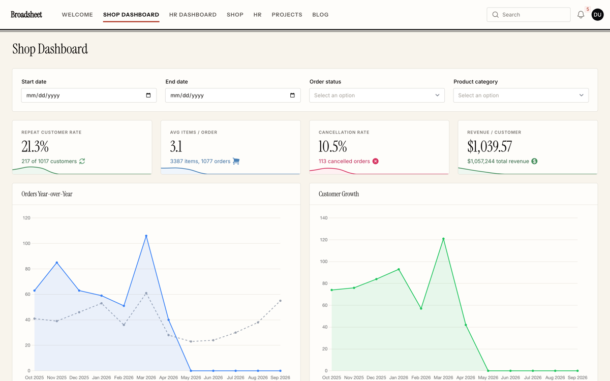
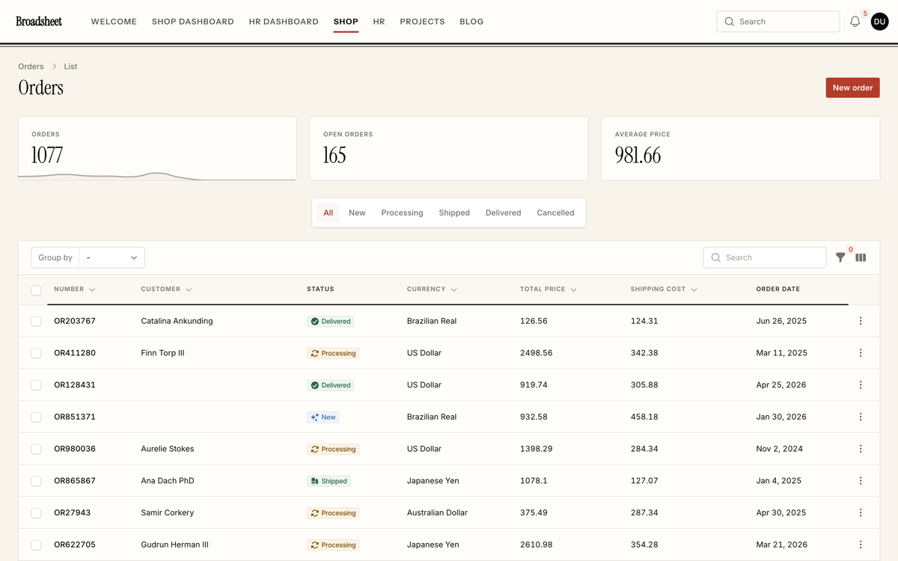
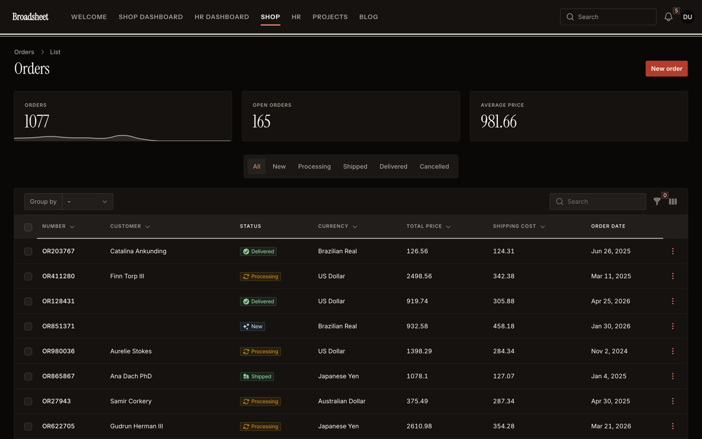
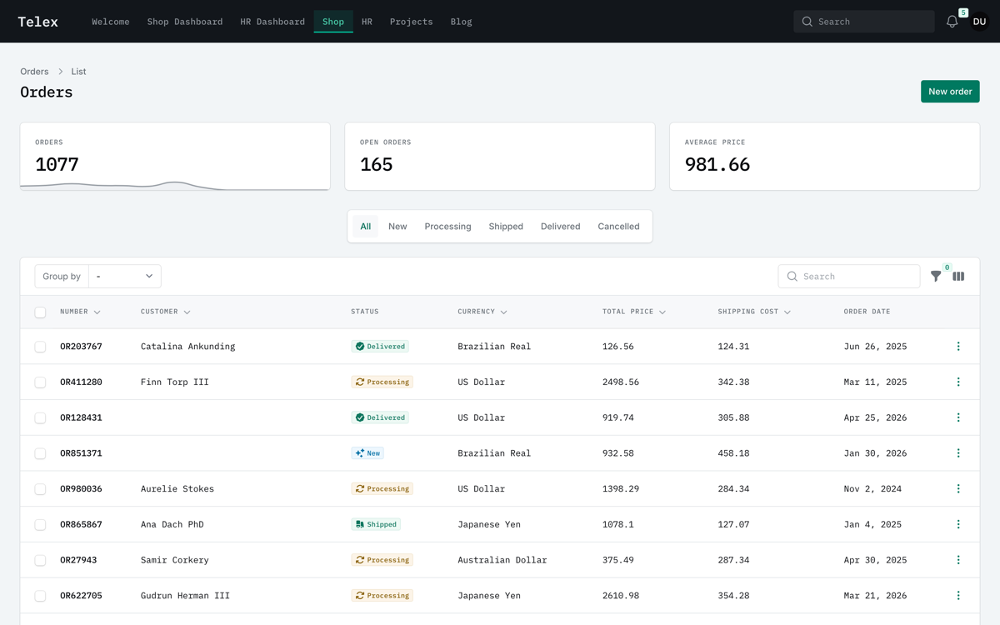
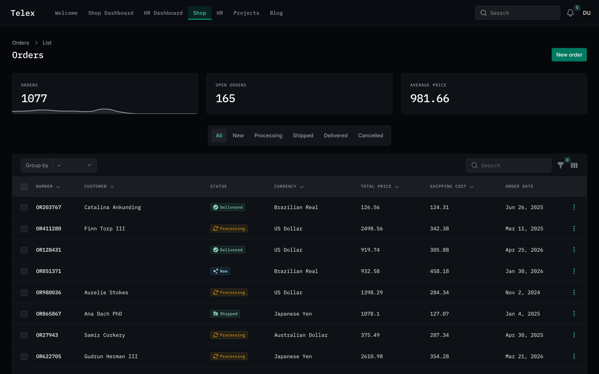
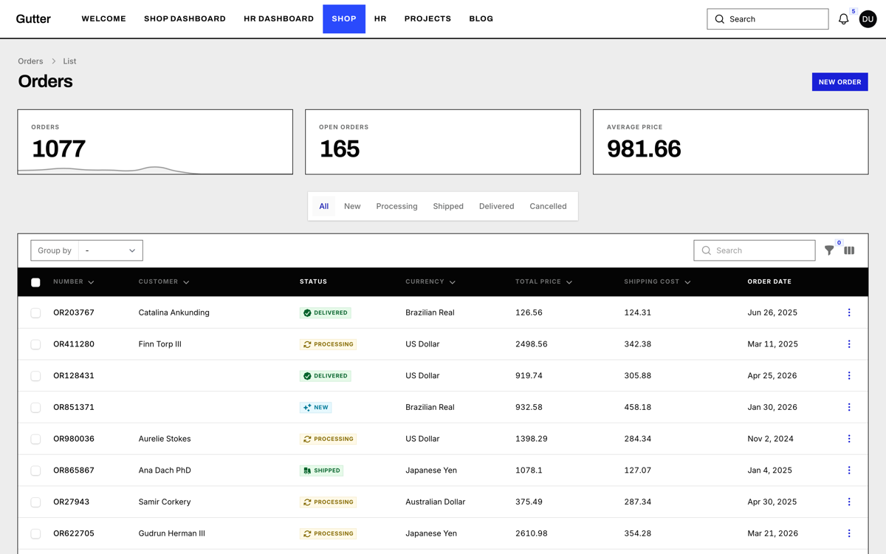
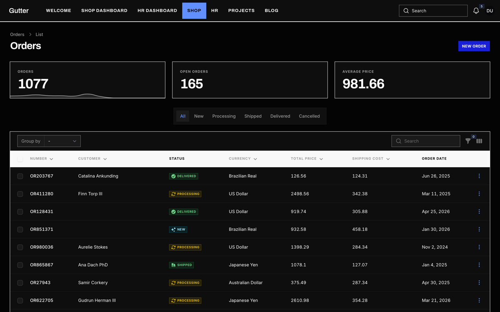
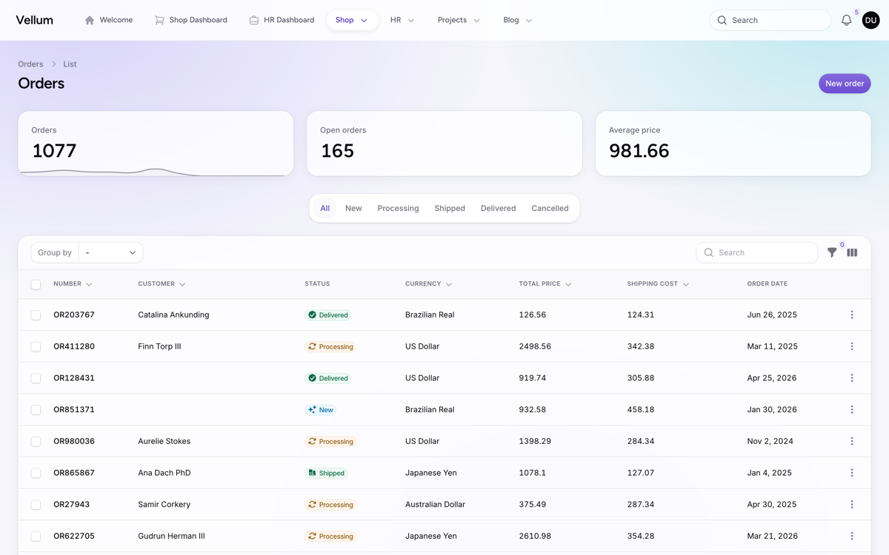
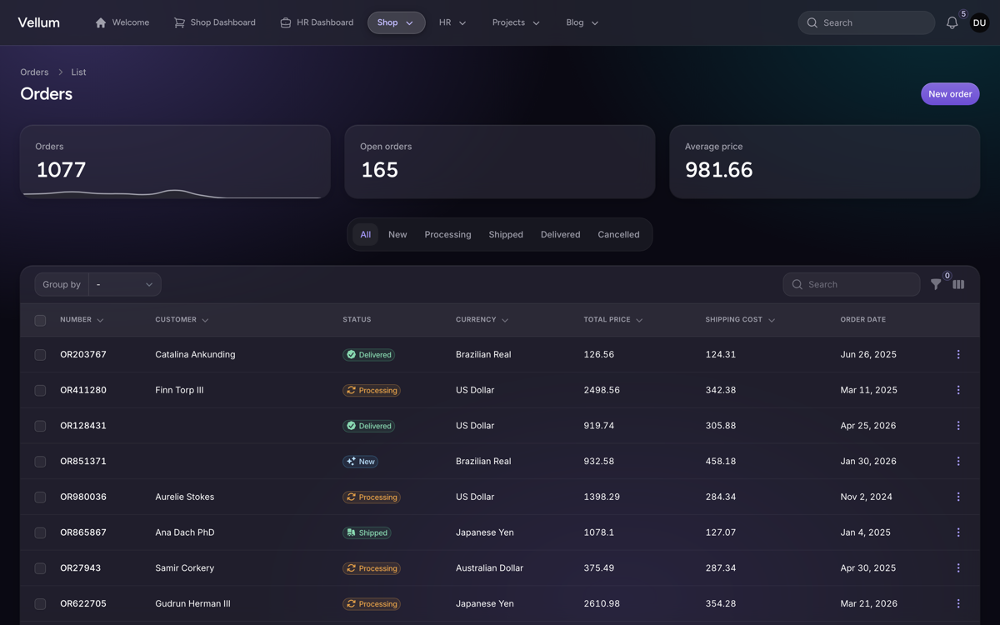

# Press — a Filament theme in four editions

[](https://packagist.org/packages/elemind/press-filament-theme)
[](https://packagist.org/packages/elemind/press-filament-theme)
[](LICENSE.md)

**The sidebar is a habit, not a requirement.**

Press moves a Filament panel's navigation into a horizontal rail across the top and gives the
screen back to the work. It ships in four editions that share one engine: not four accent
colours, but four publications — type, shape, navigation and colour move together.



## Why a rail

A vertical sidebar spends a fifth of every screen restating where you are. On a table with nine
columns that fifth is the difference between reading a row and scrolling it. Newspapers settled
this a century ago: the masthead runs across the top, the columns run the full width beneath it,
and nothing permanent eats into the page.

The rail is the family signature, and the rest follows from it. Rules instead of striped rows,
because a rule is a boundary and a stripe is decoration. Tabular figures, so that a column of
money reads as a column. One family for headings, section titles and statistics, so a page has a
voice. Status colours mixed as printing inks rather than left at the framework's defaults, which
on warm paper read as somebody else's website.

Below `lg` the rail steps aside and Filament's own drawer takes over, exactly as it does without
this theme.

## The four editions

| Edition | Character |
|---|---|
| **Broadsheet** | Masthead red on warm neutrals. Instrument Serif headings, small caps under a double rule |
| **Telex** | Phosphor green on cold graphite. IBM Plex Mono headings, a bar that stays dark in both modes |
| **Gutter** | Ultramarine on pure neutrals. Archivo, zero radius everywhere, edge-to-edge nav blocks |
| **Vellum** | Iris on violet neutrals. Figtree, generous radii, glass pills and a three-radial wash |

Every screen in both modes. Judge the pairs yourself — a theme that only works in one of them is
half a theme.

| Light | Dark |
|---|---|
|  |  |
|  |  |
|  |  |
|  |  |

## What it changes

| | Filament, out of the box | Press |
|---|---|---|
| Navigation | Vertical sidebar, ~16rem of every screen | A horizontal rail; the full width goes to the content |
| Headings | The body face at a larger size | A display face per edition, sized as headlines |
| Surfaces | Cards on a tinted page | Rules and bands; cards where a card is the point |
| Status colours | Framework defaults | Mixed per edition against that edition's ground |
| Sign-in page | An empty field with a card in it | A composed screen: column rules, cell matrix, grid or wash |

## Accessibility

Measured, not asserted: on the rendered page, in a browser, with translucent layers composed
against what is actually behind them, using the WCAG 2.1 formula — not estimated from the palette.

| Edition | Contrast | Tightest margin | Focus indicator |
|---|---|---|---|
| Broadsheet | 98 / 98 AA | 4.75:1 | 5.36:1 |
| Telex | 98 / 98 AA | 4.65:1 | 4.91:1 |
| Gutter | 98 / 98 AA | 4.59:1 | 6.34:1 |
| Vellum | 98 / 98 AA | 4.56:1 | 5.26:1 |

**392 of 392 measurements pass AA**, across three pages in both modes. Beyond contrast:

- **Focus** (2.4.7, 1.4.11) is drawn with `outline`, not by borrowing the ring, so it survives
  every component that redefines its own shadow.
- **Target size** (2.5.8) is held by a `min-height` on the sort buttons; the rest qualifies under
  the spacing exception.
- **Reduced motion** drops the theme's own transitions only. It does not override motion the
  application chose.
- **Forced colors** keeps borders in `CanvasText` and the active underline in `Highlight`, and
  turns the rail's edge fade off.
- **RTL**: not one physical property in the stylesheet.

## Requirements

| PHP | 8.3+ |
|---|---|
| **Laravel** | 11.28+, 12 or 13 |
| **Filament** | 5.x |

## Installation

```bash
composer require elemind/press-filament-theme
```

Register the plugin in each panel provider that should use Press:

```php
use Elemind\PressFilamentTheme\PressFilamentTheme;
use Elemind\PressFilamentTheme\Enums\PressVariant;

public function panel(Panel $panel): Panel
{
    return $panel
        ->plugin(
            PressFilamentTheme::make()->variant(PressVariant::Telex)
        );
}
```

> [!IMPORTANT]
> Register the plugin first. Filament collects the stylesheets from the registered
> plugin, so running the command on a panel without it publishes nothing — and
> reports no error.

```bash
php artisan filament:assets
```

That is the whole install. **The stylesheet ships compiled**: no Tailwind pass, no Vite entry, no
`npm` step in your deploy. Re-run `php artisan filament:assets` after every `composer update` that
touches this package, and as part of your deploy — it is what copies the stylesheets into `public/`.

Each edition also has a shortcut, and with none set you get Broadsheet:

```php
PressFilamentTheme::make()->broadsheet();
PressFilamentTheme::make()->telex();
PressFilamentTheme::make()->gutter();
PressFilamentTheme::make()->vellum();
```

### The rail

The plugin turns on `topNavigation()` for you and registers the script that marks which edge of
the rail still has content behind it.

```php
PressFilamentTheme::make()->telex()->rail(false); // keep Filament's sidebar
```

Turning it off is not a downgrade path: the palette, the typography, the table treatment, the
status ramps and the sign-in page all still apply. Only the rail styling stops.

### Dark mode

Both modes are supported with no configuration; the editions are measured in both. Telex is the
one designed dark-first — the bar stays graphite either way — and it is at its best with:

```php
use Filament\Enums\ThemeMode;

->defaultThemeMode(ThemeMode::Dark)
```

That stays your call: the theme never changes the panel's theme mode on its own.

### Fonts

Fonts are served from [Bunny Fonts](https://fonts.bunny.net) — GDPR-friendly, no request to Google
Fonts. Each edition sets its own sans and, for Broadsheet, a serif; all four share IBM Plex Mono.
To self-host them, override after registering the plugin:

```php
->font('Instrument Sans', url: asset('css/fonts/instrument-sans.css'))
```

A panel with no network access to a font CDN still reads correctly — it just stops sounding like
itself.

## Two ways to use it

### Precompiled (default)

The package ships four compiled stylesheets, one per edition. `composer require`, the plugin
registration above, then `php artisan filament:assets` is the whole setup.

The trade-off is the one every precompiled Filament theme has: the CSS is built without seeing
your app, so **Tailwind utilities you write in your own Blade files are not generated**. Filament's
own UI is unaffected — it uses semantic `fi-*` classes throughout.

### From source

If you write Tailwind utilities in your Blade files, or you need to compose Press with CSS from
other plugins, compile it yourself. Publish the sources:

```bash
php artisan vendor:publish --tag="press-filament-theme-css"
```

That copies the engine to `resources/css/press/engine` and the presets to
`resources/css/press/presets`. Import them into your panel's theme file, after Filament's and
before your `@source` directives:

```css
@import '../../../../vendor/filament/filament/resources/css/theme.css';

@import '../../press/engine/engine.css';
@import '../../press/engine/rail.css';
@import '../../press/presets/telex.css';

@source '../../../../app/Filament/**/*';
@source '../../../../resources/views/filament/**/*';
```

You can skip the publish step and import straight out of `vendor/` if you would rather not
duplicate the files — the paths are longer and move with the package:

```css
@import '../../../../vendor/elemind/press-filament-theme/resources/css/engine/engine.css';
```

Keep the plugin registered either way: it still applies the fonts and the rail script, so
`php artisan filament:assets` stays part of the install — it is what publishes that script, and the
presets the runtime switch fetches. It detects `viteTheme()` on the panel and stops short of setting
its own theme, so the two do not fight. Be aware that `Panel::getTheme()` gives `viteTheme()`
precedence unconditionally — once your panel compiles its own CSS, that file is the only one
Filament will load, and `applyTheme(true)` cannot change that.

```php
PressFilamentTheme::make()->telex()->applyTheme(false); // never set the packaged theme
```

## Letting people choose

Off by default. Turn it on and everyone picks their own edition:

```php
PressFilamentTheme::make()->broadsheet()->runtimeSwitch();
```

A "Theme" entry appears in the user menu; picking an edition stores the choice and reloads the
page. `->variant()` stays the default for anyone who has not chosen yet.

Offer only some of them:

```php
PressFilamentTheme::make()->runtimeSwitch([PressVariant::Telex, PressVariant::Gutter]);
```

A stored choice outside that list falls back to the default. If the default itself is not in the
list, the first offered edition takes its place — otherwise it would be a default nobody could
return to.

### Where the choice lives

In a cookie named `press_variant`, for a year, read on every request — including for guests, so
the login screen keeps the edition someone last used. To keep it somewhere else, hand over the two
ends:

```php
PressFilamentTheme::make()
    ->runtimeSwitch()
    ->variantResolver(fn () => auth()->user()?->press_variant)
    ->variantPersister(fn (PressVariant $variant) => auth()->user()->update([
        'press_variant' => $variant->value,
    ]));
```

The resolver may return a `PressVariant` or its string value (`'broadsheet'`, `'telex'`,
`'gutter'`, `'vellum'`). The two are independent: reading from the database while still writing a
cookie is a legitimate combination. Note that a cookie is per browser, not per identity — the same
person on two devices gets two editions until they choose on each.

### Putting the switcher elsewhere

```php
PressFilamentTheme::make()->runtimeSwitch()->switcherUi(false);   // not in the user menu

PressFilamentTheme::variantAction()                              // put it where you like
```

`->switcherVisible(fn () => auth()->user()->isAdmin())` gates the entry; the closure runs at render
time, so the authenticated user is available. It also accepts a plain `bool`.

### With a theme you compile yourself

The switch works in both installation modes, but a panel that compiles its own theme has to leave
the edition out of it. Import the engine and the rail, and **not** a preset:

```css
@import '../../../../vendor/filament/filament/resources/css/theme.css';

@import '../../press/engine/engine.css';
@import '../../press/engine/rail.css';

@source '../../../../app/Filament/**/*';
@source '../../../../resources/views/filament/**/*';
```

The plugin then adds the chosen preset after your stylesheet. Leaving a preset compiled in does
not work: a preset is written to sit on the engine's defaults, not on another preset, so any token
the compiled one declares and the chosen one does not would survive — you get one edition's
colours with another's typography.

## Customising

> [!IMPORTANT]
> **Press overrides the panel's `->colors()`.** The engine maps its own ramps onto Filament's
> `--primary-*` and `--gray-*` variables at `:root:root`, which outranks the palette Filament
> prints inline. A panel that sets `->colors(['primary' => Color::Amber])` alongside Press will
> not show amber — and nothing warns you.

To change the colours, change the theme's own tokens rather than Filament's. Every edition is a
list of `--press-*` declarations sitting on the engine's defaults; your own stylesheet, loaded
after the theme, can do the same:

```css
:root:root {
    --press-primary-500: oklch(0.55 0.18 240);
    --press-radius-md: 0.5rem;
}

.dark {
    --press-primary-500: oklch(0.68 0.15 240);
}
```

Two rules worth knowing. Declare a token in **both** `:root` and `.dark` if it should differ
between modes — a `:root` declaration in a later stylesheet beats an earlier `.dark` one at equal
specificity. And write a switched-off shadow as `0 0 #0000`, never `none`: the theme's shadows are
composed from several variables, and a `none` in the middle collapses the whole declaration.

## Reference

**Editions** — `PressVariant::Broadsheet | Telex | Gutter | Vellum`, string values `'broadsheet'`,
`'telex'`, `'gutter'`, `'vellum'`.

**Plugin methods**

| Method | Default | Does |
|---|---|---|
| `variant(PressVariant)` | `Broadsheet` | Picks the edition |
| `broadsheet()` `telex()` `gutter()` `vellum()` | | Shortcuts for the above |
| `rail(bool)` | `true` | Horizontal navigation; `false` keeps the sidebar |
| `applyTheme(bool)` | auto | Force the packaged theme on or off instead of detecting `viteTheme()` |
| `runtimeSwitch(bool\|array)` | `false` | Lets people choose; an array narrows the offer |
| `variantResolver(?Closure)` | cookie | Where the choice is read from |
| `variantPersister(?Closure)` | cookie | Where the choice is written to |
| `switcherUi(bool)` | `true` | Whether to add the entry to the user menu |
| `switcherVisible(bool\|Closure)` | `true` | Gates that entry |
| `PressFilamentTheme::variantAction(string)` | `'pressVariant'` | The switcher as an `Action`, to place yourself |

**Published assets** — `php artisan filament:assets` writes
`public/css/elemind/press-filament-theme/press-<edition>.css` (the compiled editions),
`press-preset-<edition>.css` (the presets alone, only fetched when the runtime switch needs them)
and `public/js/elemind/press-filament-theme/press-rail.js`.

**Cookie** — `press_variant`, one year, only written when the runtime switch is on.

Anything marked `@internal` in the source is implementation: it is public because the framework
needs it to be, not because it is an API to build on.

## Testing

```bash
composer test
```

## Development

```bash
npm install
npm run build          # all four editions
npm run dev:telex      # watch one
```

The Tailwind version is pinned exactly, so that the compiled stylesheets in `resources/dist/` can be
reproduced byte for byte.

## Changelog

Please see [CHANGELOG](CHANGELOG.md) for what has changed recently.

## Contributing

Please see [CONTRIBUTING](.github/CONTRIBUTING.md) for details.

## Security

Please review [our security policy](.github/SECURITY.md) on how to report security vulnerabilities.

## Credits

- [elemind](https://github.com/elemind)
- [All Contributors](../../contributors)

## License

The MIT License (MIT). Please see [License File](LICENSE.md) for more information.

Press is a third-party theme. It is not affiliated with or endorsed by Filament. The panel in the
screenshots is the Filament demo application, restyled.
